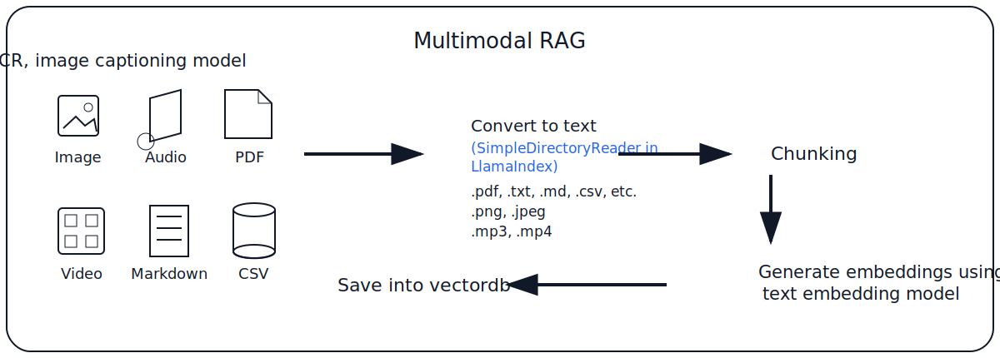
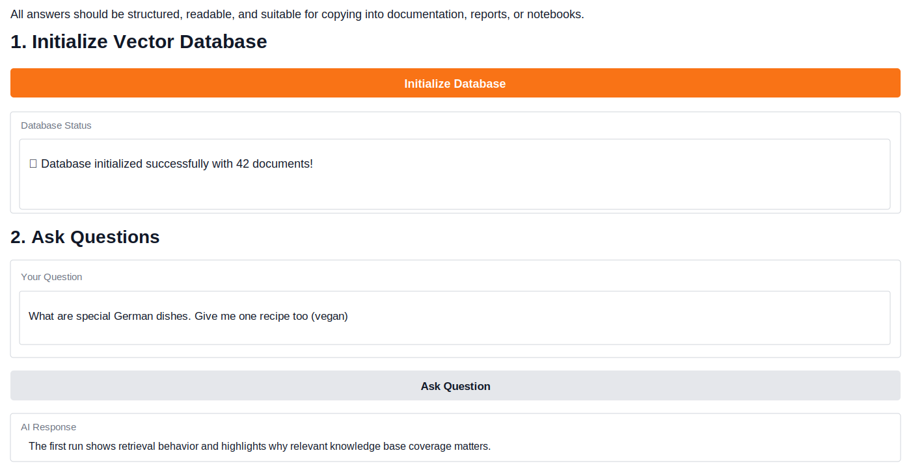
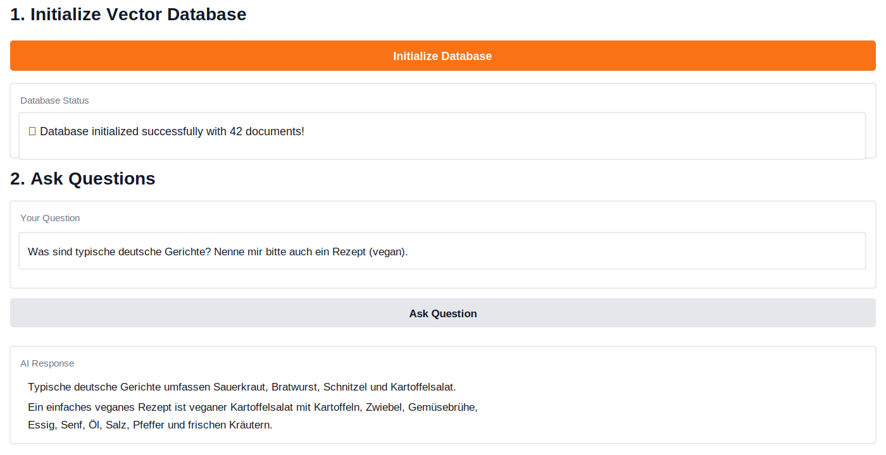

# Polyglot RAG Lab

A multilingual **Basic + Advanced RAG** showcase using notebooks, Gradio, vector databases, document parsing, chunking, embeddings, and retrieval-based answering.

This project demonstrates how a retrieval-augmented generation pipeline can answer questions from a small knowledge base and handle multilingual queries such as English and German.

## Project highlights

- Basic RAG workflow with vector database initialization
- Advanced RAG answer generation workflow
- Gradio interface for asking questions over a local knowledge base
- Multilingual retrieval demonstration with German and English queries
- Sample data prepared for parsing, chunking, embedding, and vector storage
- Documentation-friendly structure for reports, notebooks, and portfolio review

## Demo proof

### Multimodal / document RAG pipeline



### Basic RAG answer in English



### Basic RAG answer in German



## Repository structure

```text
polyglot-rag-lab/
├── data/
│   ├── raw/
│   │   ├── markdown/
│   │   │   └── german_vegan_food_guide.md
│   │   ├── text/
│   │   │   ├── italian_recipe_notes.txt
│   │   │   └── audio_transcript_sample.txt
│   │   ├── tables/
│   │   │   └── european_vegan_recipes.csv
│   │   └── multimodal/
│   │       └── image_caption_samples.csv
│   ├── processed/
│   │   └── chunks_preview.jsonl
│   └── vector_store/
│       └── .gitkeep
├── docs/
│   └── pipeline.md
├── notebooks/
│   └── README.md
├── screenshots/
│   ├── multimodal-rag-pipeline.svg
│   ├── basic-rag-english-demo.svg
│   └── basic-rag-german-demo.svg
├── .gitignore
├── requirements.txt
└── README.md
```

## End-to-end RAG pipeline

The project follows a practical RAG workflow:

```text
Raw files
  ↓
Parsing / loading
  ↓
Text normalization
  ↓
Chunking
  ↓
Embedding generation
  ↓
Vector database storage
  ↓
Retriever
  ↓
Prompt construction with retrieved context
  ↓
LLM answer generation
  ↓
Structured response for reports, notebooks, or documentation
```

## 1. Raw data layer

The `data/raw/` folder contains sample inputs that represent the kind of content a RAG system may need to parse.

| Folder | Purpose | Example |
|---|---|---|
| `markdown/` | Long-form structured documents | German vegan food guide |
| `text/` | Plain text, transcripts, notes | Audio transcript and recipe notes |
| `tables/` | CSV-style structured knowledge | European vegan recipe table |
| `multimodal/` | Captions or extracted descriptions from images/videos | Image caption samples |

In a real multimodal RAG system, images, audio, PDFs, video, CSV, and Markdown files are first converted into text or structured metadata before embedding.

## 2. Parsing layer

Typical parsing tools may include:

- `SimpleDirectoryReader` from LlamaIndex for text, Markdown, PDF, CSV, and other document formats
- OCR for scanned images or screenshots
- Image captioning models for visual content
- Speech-to-text models for audio
- Video frame extraction plus captioning/transcription for video

The output of parsing should be normalized text with useful metadata, for example:

```json
{
  "source": "data/raw/markdown/german_vegan_food_guide.md",
  "modality": "markdown",
  "language": "en",
  "topic": "German vegan food",
  "text": "Kartoffelsalat is a common German dish that can be made vegan..."
}
```

## 3. Chunking layer

Large documents are split into smaller chunks before embedding. Good chunks should be:

- Small enough to retrieve precisely
- Large enough to preserve meaning
- Stored with source metadata
- Overlapped slightly to avoid losing context across boundaries

Example chunking settings:

```text
chunk_size = 512
chunk_overlap = 50
```

## 4. Embedding layer

Each chunk is converted into a numerical vector using an embedding model. These vectors allow semantic search, so the system can retrieve relevant content even when the user asks in different words or a different language.

Example:

```text
Question: Was sind typische deutsche Gerichte?
Retrieved chunk: German dishes include Kartoffelsalat, Sauerkraut, Bratwurst, Schnitzel, and regional stews...
```

## 5. Vector database layer

The vector database stores:

- Chunk text
- Embeddings
- Metadata
- Source paths
- Optional language and modality tags

The `data/vector_store/` folder is included as a placeholder. Generated vector database files are usually ignored from Git because they can become large and environment-specific.

## 6. Retrieval layer

When the user asks a question, the system:

1. Embeds the question
2. Searches the vector database
3. Retrieves the most relevant chunks
4. Builds a context-aware prompt
5. Sends the prompt to the language model

## 7. Answer generation layer

The model answers using retrieved context, rather than relying only on its internal training data. This makes the system more grounded, auditable, and useful for domain-specific knowledge bases.

Example multilingual behavior:

```text
German question:
Was sind typische deutsche Gerichte? Nenne mir bitte auch ein Rezept vegan.

Expected RAG behavior:
Retrieve German food chunks, identify typical dishes, then generate a vegan recipe such as vegan Kartoffelsalat.
```

## Suggested GitHub description

```text
A multilingual Basic and Advanced RAG showcase using vector databases, Gradio apps, sample data, and notebook-based workflows.
```

## Suggested topics

```text
rag, advanced-rag, basic-rag, multilingual-rag, gradio, vector-database, llamaindex, embeddings, ai-engineering, notebooks
```

## Next improvements

- Add the original assignment notebooks into `notebooks/`
- Add advanced RAG screenshots showing retrieved context and improved answer quality
- Add source citation display inside the Gradio app
- Add hybrid retrieval using vector search plus keyword search
- Add reranking and evaluation metrics
